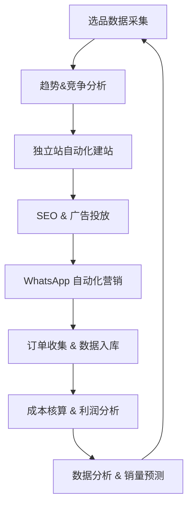

# 📌 项目简介

本项目旨在通过**独立站（Shopify/WordPress 或自建站）+ 跨境电商推广（SEO、Google Ads、社交媒体、WhatsApp 营销）**的模式，打造一个电子产品的国际销售闭环。
依托 Python 技术，建立选品分析、自动化营销、数据追踪和转化分析的系统，提升效率与精细化运营能力。

---

# 🚀 项目目标

1. **精准选品**：聚焦电子产品，满足跨境消费者的痛点。
2. **独立站搭建**：建立品牌化官网，支持多语言、多币种支付。
3. **线上推广**：结合 SEO、Google Ads、社交媒体广告。
4. **WhatsApp 营销**：通过自动化脚本提升私域转化。
5. **成本核算**：集成商品成本、物流费用、汇率换算，自动生成利润报表。
6. **数据驱动**：Python 脚本自动化选品分析、广告数据监控、销量预测。

---

# 📂 项目结构

```bash
ecig-cross-border/
├── README.md                # 项目说明
├── requirements.txt         # Python 依赖库
├── src/
│   ├── product_research/    # 选品模块（爬虫+数据分析）
│   ├── customer_discovery/  # 客户挖掘（Google Maps/门店数据）
│   ├── website/             # 独立站自动化建站
│   ├── marketing/           # SEO/广告/WhatsApp 推广
│   ├── sales/               # 订单管理 + CRM
│   ├── analytics/           # 可视化 & 预测分析
│   ├── financial/           # 财务与成本模块
│   │   ├── cost_analysis.py # 成本核算（SKU/物流/订单）
│   │   ├── exchange_rate.py # 汇率管理（CNY 转 USD/EUR）
│   │   └── profit_calc.py   # 利润计算 & 报表输出
│   └── utils/               # 数据库 & 工具函数
├── data/                    # 数据存放（products.csv, logistics.csv）
└── docs/                    # 项目文档

```

---

# 🛠️ 技术栈

* **语言**：Python 3.10+
* **Web 框架**：Flask / FastAPI（用于后台 API 服务）
* **数据库**：PostgreSQL（结构化数据），MongoDB（用户行为数据）
* **可视化**：Plotly/Dash, Matplotlib
* **爬虫**：Requests, BeautifulSoup, Scrapy
* **自动化**：Selenium（竞品监控/广告后台操作）
* **AI/预测**：Scikit-learn, Prophet（销售预测）
* **外部 API**：Shopify API, Google Ads API, WhatsApp API

---

# 📊 核心流程

## 1. 选品（Product Research）

### 1.1. 大方向选品思路（宏观层面）

在跨境电商中，选品要从趋势和需求出发，先确定一个 **赛道方向**：

* **智能可穿戴**：智能眼镜（AR/VR）、智能手表、智能戒指
* **消费电子**： 无线耳机、蓝牙音箱、游戏手柄、键鼠
* **智能家居**：* 智能插座、扫地机器人、家用安防摄像头
* **3C周边配件**：手机支架、快充头、数据线、保护壳、移动电源
* **健康与运动类**：智能运动手环、心率监测器、运动耳机
* **新兴方向**：AI 辅助设备（AI翻译机、AI学习机）、车载智能设备（HUD、行车记录仪）

👉 这个阶段不考虑具体型号，只锁定 **赛道方向**，结合趋势和技术成熟度。

---

### 1.2. 中观层面（细化品类，筛选潜力爆款）

大方向确定后，需要结合市场数据进行 **二次筛选**：

- **平台热销榜单分析**
   * Amazon、AliExpress、Temu、Shopee、Lazada、独立站
   * 关键词搜索 + 排行榜 → 确定热销品类
- **用户需求痛点挖掘**
   * 例如：
     * 智能眼镜 → 痛点是续航、佩戴舒适度
     * 蓝牙耳机 → 痛点是降噪、防水、低延迟
     * 移动电源 → 痛点是容量、快充、多口
- **价格带选择**
   * 低价刚需（<20美金）：配件类、手机壳、数据线
   * 中端品质（20-80美金）：耳机、手表、车载产品
   * 高客单（80-300美金）：智能眼镜、VR、机器人
- **利润空间核算**
   * 工厂报价 + 物流成本 + 平台佣金
   * 保证毛利 ≥ 30%（理想状态 40-50%）

这样就能筛选出 “值得测试的品类”，比如：
* 智能眼镜（高客单，新兴市场）
* 蓝牙耳机（成熟市场，差异化机会）
* 快充移动电源（功能升级）

---

### 1.3. 微观层面（不同国家市场差异化开发）

不同国家消费者需求差异明显，需要 **本地化选品**：
- 美国/欧洲
  - 偏爱 **高科技 & 高品质**
  - 接受高客单（100-300美金）
  - 适合：智能眼镜、智能家居、游戏外设

- 东南亚（印尼、菲律宾、泰国、马来西亚）
  - 价格敏感，注重 **性价比**
  - 爆款常集中在 **20-50美金**
  - 适合：蓝牙耳机、快充头、运动手环

- 中东（沙特、阿联酋）
  - 消费力强，追求新奇 & 炫酷
  - 适合：AR/VR设备、豪华音箱、车载智能设备

- 日本/韩国
  - 偏好 **小巧精致、功能实用**
  - 强调设计感 & 品质
  - 适合：智能翻译机、健康监测手表、小型投影仪

- 拉美（巴西、墨西哥）
  - 市场增长快，但支付/物流受限
  - 适合：低单价配件类，如蓝牙耳机、手机壳、支架

---

### 1.4. 选品流程总结

1. **锁定方向**：电子/3C → 智能可穿戴/消费电子/配件
2. **筛选品类**：通过平台数据 & 用户痛点分析 → 确定候选产品
3. **验证利润**：计算成本、物流、平台佣金，确保毛利 ≥30%
4. **市场差异化开发**：根据不同国家消费习惯 → 调整产品组合

---

⚡ 举例：

* 大方向 → 智能眼镜
* 中观筛选 → 降噪耳机、快充电源
* 美国市场 → 高端智能眼镜（AI+AR）
* 东南亚市场 → 低价蓝牙耳机、快充头
* 中东市场 → 炫酷车载HUD

---


## 2. 建站（Independent Website）

* 使用 Shopify/WordPress API 快速部署产品页
* 自动上传产品图片、描述、SEO 标签
* 配置多语言（英语、西班牙语）和多支付方式（PayPal、信用卡）

## 3. 推广（Marketing）

* **SEO**：自动生成关键词优化报告
* **Google Ads/Meta Ads**：通过 API 自动化调整广告预算
* **WhatsApp 自动化**：

  * 导入客户手机号
  * 批量发送定制化消息（新产品、优惠券）
  * 追踪点击率与转化率

## 4. 销售与订单管理

* 自动抓取订单信息，写入 PostgreSQL
* 建立客户画像（消费频率、复购率）
* Python 脚本自动计算 GMV、毛利率

## 5. 成本与利润分析（Financial Analysis）

* **输入表格**：

  * `products.csv`：SKU、商品名、供应商、单价（人民币）、重量
  * `logistics.csv`：物流公司、运输方式、单件运费、按kg运费、物流SKU

* **计算逻辑**：

  * 按 SKU 匹配物流方案
  * 根据订单数量 & 重量，计算运输成本
  * 自动合并产品成本 + 运费
  * 使用 `exchange_rate.py` 按需转换为 USD/EUR 等币种，金额保留 2 位小数

* **输出报表**：

  * 每个 SKU 的总成本、运输成本、利润率
  * 支持导出 CSV/Excel，供财务复盘

## 5. 数据分析与预测

* Dash 搭建数据可视化仪表盘（实时销量、广告 ROI）
* Prophet/ARIMA 模型预测未来 30 天销量趋势
* 结合库存策略优化采购计划

---

## 📈 示例工作流



---

## 📦 安装与运行

```bash
# 克隆项目
git clone https://github.com/yourname/ecig-cross-border.git
cd ecig-cross-border

# 安装依赖
pip install -r requirements.txt

# 启动分析仪表盘
python src/analytics/dashboard.py
```

---

## 📌 后续规划

1. 增加 **AI 自动文案生成**（结合 ChatGPT/Claude）
2. 实现 **广告自动投放调优**（A/B Test 自动化）
3. 支持 **跨平台订单同步**（Amazon + Shopify + eBay）

---